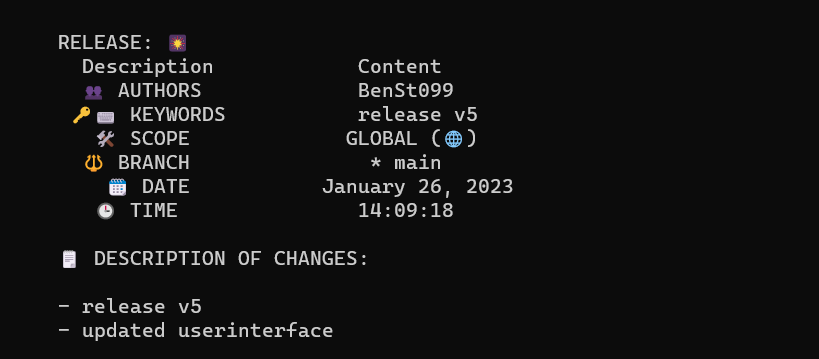

= 🔥FireCommit

image:https://img.shields.io/badge/license-GNU%20Public%20v3-critical[]
image:https://img.shields.io/badge/version-v5.4%20--%20stable-brightgreen[]
image:https://img.shields.io/badge/lang-87b5e0?style=flat&logo=Python[]
image:https://img.shields.io/badge/Extension-133b61?style=flat&logo=Git[]
image:https://img.shields.io/badge/FireCommit-910806?style=flat&logo=Fireship[]

[.text-center]

== Features

 > The script offers an easy step-to-step protocol for generating a commit message.

 > You can directly run git commit and git push very quickly from the script.

 > If any files are unstaged, the script warns you.

== Description

This simple script helps you write good git commit messages. It automatically generates a git commit in the same directory where you run it. 

== Requirements

- Python, Vesion >= 3.7 [ https://www.python.org/downloads/[Installation] ]
- prettytable library [ https://pypi.org/project/prettytable/[Installation] ]

== Installation

In your git repository, add the following to your `.gitignore` : 

[source,shell]
--
FireCommitScript.py
--

Plus, add the content of the `.gitignore` in this repo (https://github.com/BenSt099/FireCommit/blob/main/.gitignore[link]) to ignore all python generated files. Then, make a commit.

Next, include the file __FireCommitScript.py__ into your repo. See **Usage** for starting the script.

== Usage

- For Windows:

[source,powershell]
--
./FireCommitScript.py
--

- For Linux:

[source,shell]
--
python3 FireCommitScript.py
--

- For MacOS:

	> Not Tested (Works on my machine 😉)

== Documentation

- The script is mostly self-explaining and guides you through every step
- If you still need some help, type "op" for displaying options when the script starts.
- For the full documentation, click https://github.com/BenSt099/FireCommit/blob/main/docs/docs.adoc[here].

== Known Issues

1. Committing Without Adding

    - The script warns you if some files are unstaged but it doesn't
      include those files into the commit. You have to manually add them to the staging area.

2. Unexpected Result When Running ``git log``

    - When writing a verbose commit message, a compromise must be made regarding the readability of the git log.

    - If you run `git log`, you may see a large amount of text that would fill up pages.

    - Using `git shortlog` will not help: 

image::pictures/BadGitShortLog.png[]

To search for single commits more easily, use

[source,shell]
----
git log --pretty=format:"%cn committed %h on %cd with Topic: %f"
----

or similar modifications.

== License

This project is licensed under GNU General Public License v3.0. Fore more information, click https://github.com/BenSt099/FireCommit/blob/main/LICENSE[here].

