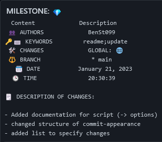
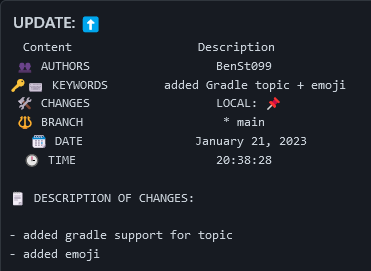

# 🔥FireCommit


<div style="text-align:center; margin-bottom:40px">


</div>

## Description

This simple script helps you write good git commit messages. It automatically generates a git commit in the same directory where you run it. 

## Requirements

- Python Vesion 3.0 or higher [[Installation]](https://www.python.org/downloads/)
- prettytable library [[Installation]](https://pypi.org/project/prettytable/)

## Installation

In your git repository, add the following to your `.gitignore` : 

    FireCommitScript.py

Plus, add the content of the `.gitignore` in this repo ([link](https://github.com/BenSt099/FireCommit/blob/main/.gitignore)) to ignore all python generated files. Then, make a commit.

Next, include the file __FireCommitScript.py__ into your repo. See **Usage** for starting the script.

## Usage

Run the following in a terminal / powershell :

```sh
./ FireCommitScript.py
```

<div class="note" style="opacity:0.7;border-radius:5px;border:2px solid rgb(2,2,2);padding:15px;margin-bottom:30px;"><p align="center">⚠️ WARNING</p> <p align="center">You should run <b>git add</b> before running the script.</p></div>       

## Documentation

- The script is mostly self-explaining.
- If you still need some help, type "op" when the script starts.

## Known Issues

When writing a verbose commit message, a compromise must be made regarding the readability of the git log.

If you run `git log`, you may see a large amount of text that would fill up pages.
Using `git shortlog` will not help: 

<div style="margin-top:30px; margin-bottom:30px">

</div>

To search for single commits more easily use

```sh
git log --pretty=format:"%cn committed %h on %cd with Topic: %f"
```
or similar options.

## License

This project is licensed under GNU General Public License v3.0. Fore more information, click [here](https://github.com/BenSt099/FireCommit/blob/main/LICENSE).