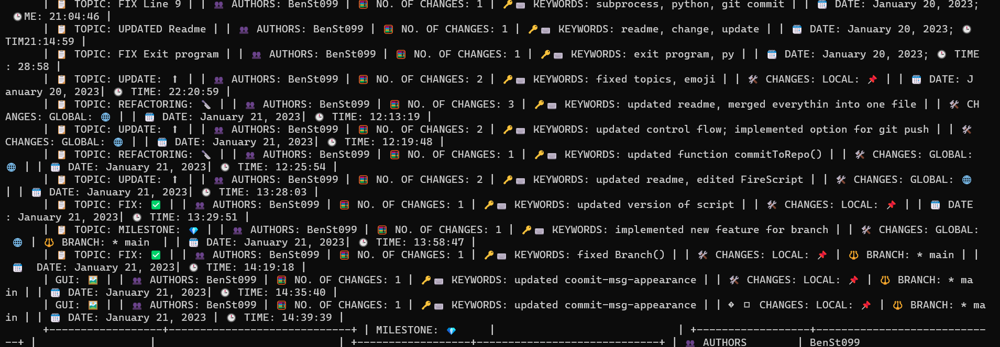

<div align="center" style="margin-bottom: 70px">
	<h1>🔥FireCommit</h1><br>
	
	
	
	
	
</div>

## Features

 > Commandline-Tool

 > Platform-independent

 > Modifications possible

## Description

In large projects it's important to use verbose and structured commit messages. This can be challenging when working in a big team with many
developers. The provided script helps you with that. 

## Requirements

- Python, Vesion >= 3.7 [ [Installation](https://www.python.org/downloads/) ]

## Installation

Download the provided files ([See Latest Release](https://github.com/BenSt099/FireCommit/releases)) and unpack them. See **Usage** for starting the script.

## Usage

First, choose the working directory (so where your project's `.git`-folder is located) by modifiying `config.json`.
Under Windows, you have to escape the backslash (e.g. __C:\\user\\projects\\yourproject\\__).

The script was tested on Windows and Linux (MacOS: Not Tested (Works on my machine 😉)). For starting the script, open a terminal / command prompt and type:

```bash
python FireCommit_v6.py
```

or

```bash
python3 FireCommit_v6.py
```

## Documentation

For the full documentation, click [here](https://github.com/BenSt099/FireCommit/blob/main/docs/docs.adoc).

## Known Issues

1. Committing Without Adding

    - The script warns you if some files are unstaged but it doesn't
      include those files into the commit. You have to manually add them to the staging area.

2. Unexpected Result When Running ``git log``

    - When writing a verbose commit message, a compromise must be made regarding the readability of the git log.

    - If you run `git log`, you may see a large amount of text that would fill up pages.

    - Using `git shortlog` will not help: 

<div align="center" style="margin-bottom: 70px">
	
</div>

To search for single commits more easily, use

```bash
git log --pretty=format:"%cn committed %h on %cd with Topic: %f"
```

or similar modifications.

## License

This project is licensed under GNU General Public License v3.0. Fore more information, click [here](https://github.com/BenSt099/FireCommit/blob/main/LICENSE).